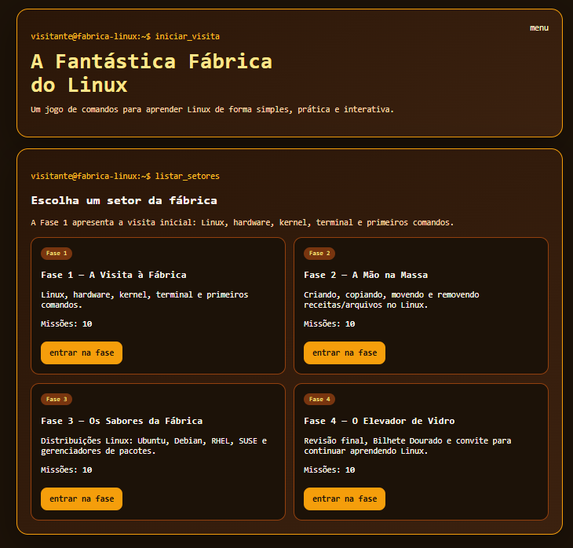
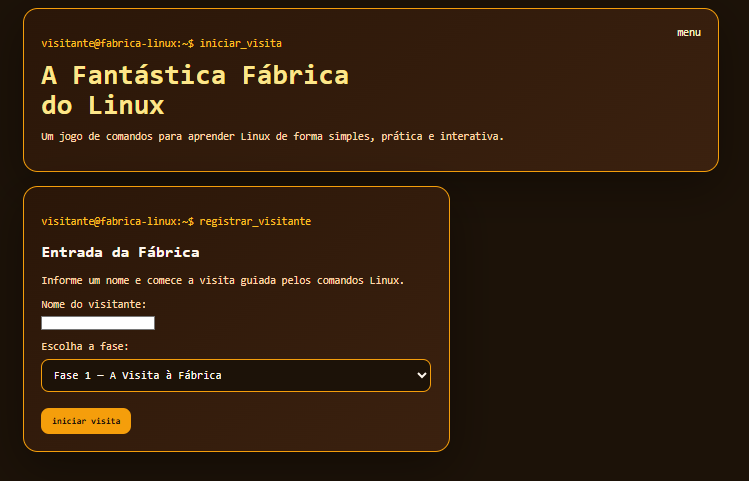
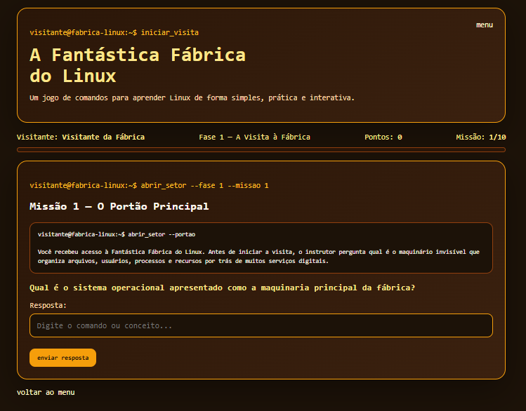
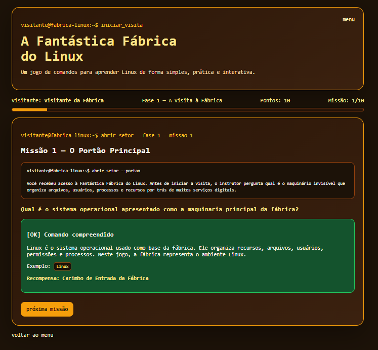

# 🍫 A Fantástica Fábrica do Linux


> Um jogo web educacional em **Python + Django** para ensinar Linux básico de forma simples, prática e interativa, usando a metáfora de uma fábrica.

---

## 📖 Sobre o projeto

**A Fantástica Fábrica do Linux** é um jogo criado para apoiar um meetup/treinamento introdutório de Linux.

A proposta é transformar conceitos que normalmente parecem difíceis — terminal, comandos, diretórios, arquivos e distribuições Linux — em uma experiência guiada por setores de uma fábrica.

O jogo foi pensado para públicos mistos, incluindo:

- pessoas iniciantes em Linux;
- profissionais de áreas administrativas;
- técnicos em começo de jornada;
- suporte de TI;
- estudantes;
- participantes de meetups;
- pessoas que têm receio da famosa “tela preta”.

O objetivo é mostrar que comandos Linux **não são mágica**: são instruções claras enviadas ao sistema por meio do terminal.

---

## 🎯 Objetivo

O jogo busca ensinar Linux básico de forma leve, prática e memorável.

Durante a experiência, o participante aprende a responder perguntas como:

- O que é Linux?
- O que é hardware?
- O que é o kernel?
- Para que serve o terminal?
- Como saber onde estou no sistema?
- Como listar arquivos?
- Como navegar entre diretórios?
- Como criar arquivos e pastas?
- Como copiar, mover e remover arquivos?
- O que são distribuições Linux?

---

## 🧠 Conceito didático

A metáfora principal do projeto é uma fábrica:

| Conceito | Metáfora no jogo |
|---|---|
| Linux | A maquinaria principal da fábrica |
| Hardware | Paredes, tubos e engrenagens físicas |
| Kernel | Trabalhadores operacionais da fábrica |
| Terminal | Painel de controle |
| Diretórios | Salas e corredores |
| Arquivos | Receitas e documentos |
| Comandos | Instruções enviadas ao sistema |
| Distribuições Linux | Sabores diferentes da mesma base |

---

## 🕹️ Como funciona o jogo

O jogador escolhe uma fase e responde missões em formato de pergunta.

Cada missão possui:

- uma pequena história;
- uma pergunta;
- uma resposta esperada;
- respostas alternativas aceitas;
- exemplo de comando;
- explicação após acerto;
- recompensa didática;
- pontuação.

Ao acertar, o jogador recebe pontos e uma recompensa simbólica relacionada ao conteúdo aprendido.

---

## 🏭 Fases disponíveis

O jogo está organizado em **4 fases**, totalizando **40 perguntas**, ideal para um meetup de aproximadamente **2 horas**.

---

### ✅ Fase 1 — A Visita à Fábrica

Introdução aos conceitos principais do Linux.

Conteúdos:

```bash
Linux
Hardware
Kernel
Terminal
pwd
ls
ls -l
ls -la
cd
cd ..
```

---

### ✅ Fase 2 — A Mão na Massa

Criação e manipulação de arquivos e diretórios.

Conteúdos:

```bash
mkdir
touch
echo
cat
cp
mv
cp -r
rm
ls
```

---

### ✅ Fase 3 — Os Sabores da Fábrica

Introdução às distribuições Linux e gerenciadores de pacotes.

Conteúdos:

```bash
distribuição Linux
Ubuntu
Debian
RHEL
SUSE
apt
dnf
apt update
apt install
```

---

### ✅ Fase 4 — O Elevador de Vidro

Revisão final do meetup e encerramento da experiência.

Conteúdos:

```bash
Linux
Kernel
Terminal
pwd
ls
cd
mkdir
touch
distribuições Linux
continuar aprendendo Linux
```

Ao finalizar a última pergunta, o jogo exibe uma tela especial de parabéns e convida o participante a continuar a jornada jogando **Detetive Linux — O Mistério da Fábrica**.

---

## 🖼️ Screenshots

### Tela inicial



### Escolha de fase



### Tela de missão



### Tela final



---

## 🛠️ Tecnologias utilizadas

- **Python 3**
- **Django**
- **SQLite**
- **HTML**
- **CSS**
- **Django Admin**

---

## 📁 Estrutura do projeto

```text
fantastica_fabrica_linux/
├── manage.py
├── requirements.txt
├── README.md
├── INSTRUCOES.md
├── .gitignore
├── fantastica_fabrica_linux/
│   ├── __init__.py
│   ├── settings.py
│   ├── urls.py
│   ├── asgi.py
│   └── wsgi.py
└── game/
    ├── __init__.py
    ├── admin.py
    ├── apps.py
    ├── forms.py
    ├── models.py
    ├── urls.py
    ├── views.py
    ├── migrations/
    ├── management/
    │   └── commands/
    │       └── seed_missions.py
    ├── static/
    │   └── game/
    │       └── css/
    │           └── style.css
    └── templates/
        └── game/
            ├── base.html
            ├── home.html
            ├── start.html
            ├── mission.html
            └── finished.html
```

---

## 🚀 Como executar localmente

### 1. Clone o repositório

```bash
git clone https://github.com/SEU_USUARIO/fantastica-fabrica-linux.git
```

```bash
cd fantastica-fabrica-linux
```

> Ajuste a URL conforme o nome real do seu repositório.

---

### 2. Crie o ambiente virtual

No Linux/macOS:

```bash
python3 -m venv venv
```

No Windows:

```powershell
python -m venv venv
```

---

### 3. Ative o ambiente virtual

No Linux/macOS:

```bash
source venv/bin/activate
```

No Windows PowerShell:

```powershell
.\venv\Scripts\Activate.ps1
```

Se o PowerShell bloquear a ativação, use:

```powershell
Set-ExecutionPolicy -Scope Process -ExecutionPolicy Bypass
.\venv\Scripts\Activate.ps1
```

No Windows CMD:

```bat
venv\Scripts\activate
```

---

### 4. Instale as dependências

```bash
pip install -r requirements.txt
```

---

### 5. Execute as migrações

```bash
python manage.py migrate
```

---

### 6. Carregue as perguntas

```bash
python manage.py seed_missions
```

Esse comando carrega as perguntas das fases no banco de dados.

---

### 7. Inicie o servidor

```bash
python manage.py runserver
```

Acesse no navegador:

```text
http://127.0.0.1:8000/
```

---

## 🔐 Django Admin

Para acessar o painel administrativo:

```bash
python manage.py createsuperuser
python manage.py runserver
```

Depois acesse:

```text
http://127.0.0.1:8000/admin/
```

No admin é possível editar:

- missões;
- perguntas;
- respostas esperadas;
- respostas alternativas;
- exemplos de comando;
- explicações;
- recompensas;
- pontuação;
- sessões dos jogadores;
- histórico de respostas.

---

## 🧬 Modelo de missão

Cada missão possui campos como:

```python
{
    "phase": 1,
    "order": 1,
    "title": "Missão 1 — O Portão Principal",
    "story": "História da missão",
    "question": "Pergunta exibida ao jogador",
    "expected_answer": "linux",
    "aliases": "Linux,LINUX",
    "command_example": "Linux",
    "explanation": "Explicação exibida após o acerto",
    "reward": "Carimbo de Entrada da Fábrica",
    "points": 10,
}
```

---

## 🏆 Pontuação e recompensas

Cada missão possui uma pontuação definida no campo:

```python
points
```

Por padrão, a maioria das missões vale:

```text
10 pontos
```

A última missão vale mais pontos e entrega o **Bilhete Dourado da Fantástica Fábrica do Linux**.

Exemplos de recompensas:

```text
Mapa de Localização da Sala
Interruptor do Comando ls
Passe dos Corredores da Fábrica
Caixa Completa dos Sabores Linux
Bilhete Dourado da Fantástica Fábrica do Linux
```

---

## 🧑‍🏫 Uso em meetup

Sugestão para um meetup de 2 horas:

```text
10 min — Abertura e explicação da metáfora da fábrica
25 min — Fase 1: A Visita à Fábrica
25 min — Fase 2: A Mão na Massa
25 min — Fase 3: Os Sabores da Fábrica
20 min — Fase 4: O Elevador de Vidro
10 min — Fechamento e convite para o Detetive Linux
5 min  — Perguntas finais
```

---

## ➡️ Próxima aventura recomendada

Ao concluir o jogo, os participantes são convidados a continuar aprendendo com:

# Detetive Linux — O Mistério da Fábrica

Essa próxima experiência aprofunda o aprendizado em formato de investigação, com problemas de infraestrutura, comandos práticos e raciocínio de suporte Linux.

---

## 📌 Comandos úteis do projeto

Rodar servidor:

```bash
python manage.py runserver
```

Carregar perguntas:

```bash
python manage.py seed_missions
```

Criar usuário administrador:

```bash
python manage.py createsuperuser
```

Executar migrações:

```bash
python manage.py migrate
```

---

## 🧹 Arquivos que não devem ir para o GitHub

O projeto já deve usar `.gitignore` para evitar arquivos como:

```text
venv/
__pycache__/
db.sqlite3
.env
*.pyc
.vscode/
.idea/
```

---

## 🔮 Melhorias futuras

Ideias para próximas versões:

- ranking dos participantes;
- modo professor;
- temporizador por pergunta;
- exportação de pontuação;
- tela com certificado simbólico;
- integração com mais fases;
- screenshots no README;
- versão Docker;
- deploy em servidor Linux.

---

## 📄 Licença

Este projeto pode ser distribuído sob a licença **MIT**.

Sugestão: adicione um arquivo `LICENSE` na raiz do projeto com o texto da licença MIT.

---

## 👨‍💻 Autor

Desenvolvido por **Leonardo Azevedo** como material de apoio para meetup e treinamento introdutório de Linux.

---

## ⭐ Apoie o projeto

Se este projeto ajudou em estudos, meetups ou treinamentos internos, considere deixar uma estrela no repositório.

```text
⭐ Star no GitHub ajuda outras pessoas a encontrarem o projeto.
```
